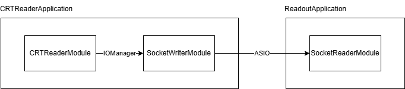
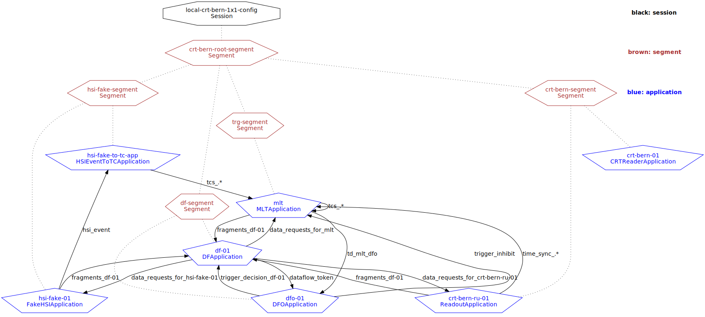
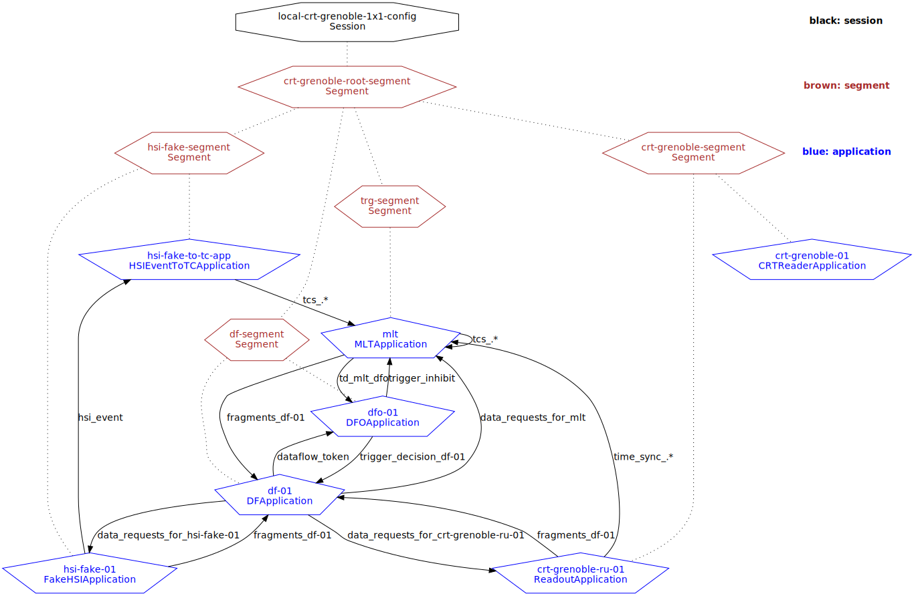

# Asiolibs

Boost.Asio-based socket reader plugin for low-bandwidth devices

# Overview

`local-crt-bern1x1-config` and `local-crt-grenoble-1x1-config` (defined in `daqsystemtest/config/daqsystemtest/example-configs.data.xml`) are session configurations with a CRT reader application accompanied by a socket reader application.

CRT reader application includes a data reader (either `CRTBernReaderModule` or `CRTGrenobleReaderModule`) which reads data from the hardware then puts it into a queue and data writers (`SocketWriterModule`) which read data from the queue then send it over a socket.

Socket reader application includes a data reader (`SocketReaderModule`) which reads data from the socket (`CRTBernFrame`/`CRTGrenobleFrame`) then puts it into another queue to be processed by `DataHandlingModel`.







# How to run

```
drunc-unified-shell ssh-standalone config/daqsystemtest/example-configs.data.xml local-crt-bern-1x1-config uname-local-test

drunc-unified-shell ssh-standalone config/daqsystemtest/example-configs.data.xml local-crt-grenoble-1x1-config uname-local-test
```

The following table includes relevant configuration details that can be set by the user. Users can either configure TCP or UDP as the socket type.

| Configuration    | Can be changed from | Object ID/Attribute name |
| ---------------- | ------------------- | ---------------- |
| Local IP         | config/daqsystemtest/moduleconfs.data.xml     | def-socket-reader-conf/local_ip
| Remote IP | config/daqsystemtest/moduleconfs.data.xml     | def-socket-writer-conf/remote_ip
| Port    | config/daqsystemtest/ru-segment.data.xml    | socket_wib_101_link0/port |
| Socket type    | config/daqsystemtest/moduleconfs.data.xml    | def-socket-reader-conf/socket_type <br> def-socket-writer-conf/socket_type |
