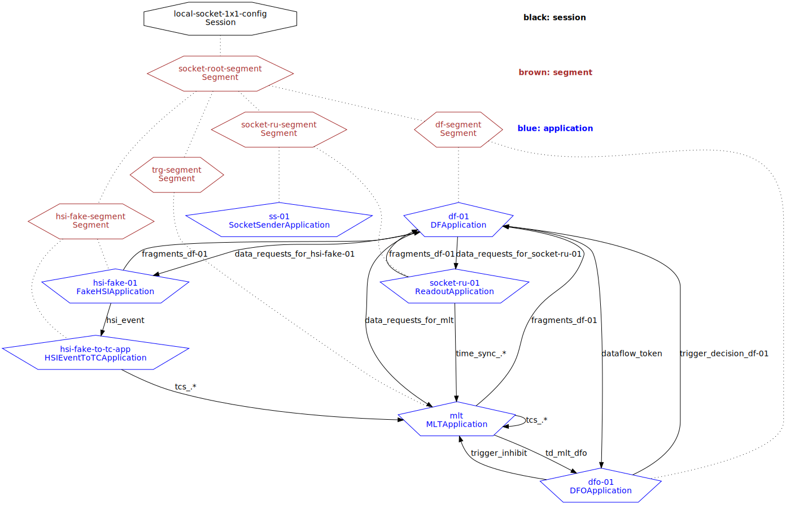

# Asiolibs

Boost.Asio-based socket reader plugin for low-bandwidth devices

# How to run

local-socket-1x1-config (from daqsystemtest/config/daqsystemtest/example-configs.data.xml) is a session configuration with a socket reader application accompanied by a fake socket writer application.

The following table includes relevant configuration details that can be set by the user. Users can either configure TCP or UDP as the socket type.

| Configuration    | Can be changed from | Object ID/Attribute name |
| ---------------- | ------------------- | ---------------- |
| Local IP         | config/daqsystemtest/moduleconfs.data.xml     | def-socket-reader-conf/local_ip
| Remote IP | config/daqsystemtest/moduleconfs.data.xml     | def-socket-writer-conf/remote_ip
| Port    | config/daqsystemtest/ru-segment.data.xml    | socket_wib_101_link0/port |
| Socket type    | config/daqsystemtest/moduleconfs.data.xml    | def-socket-reader-conf/socket_type   def-socket-writer-conf/socket_type |

The currently-used sender application creates a fake packet and sends it through the opened port, it has no relation to the latency buffer. When the reader application receives the packet, it puts the packet onto the buffer.
